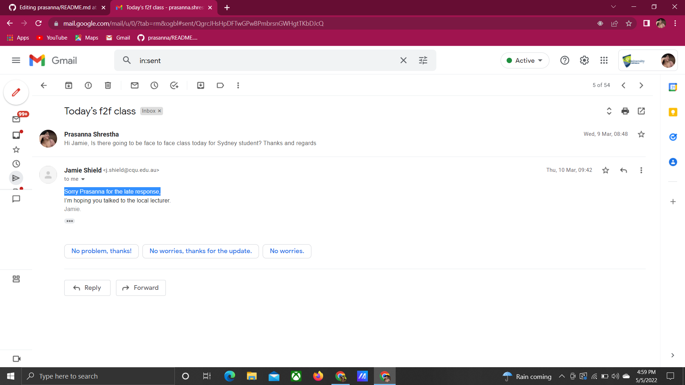
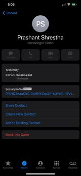
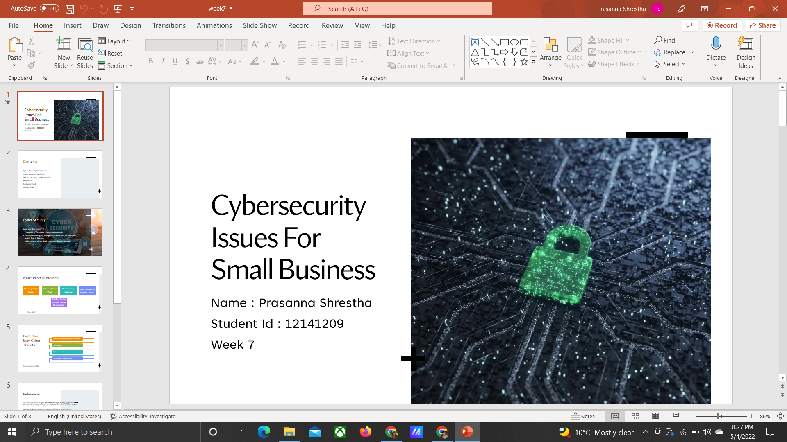
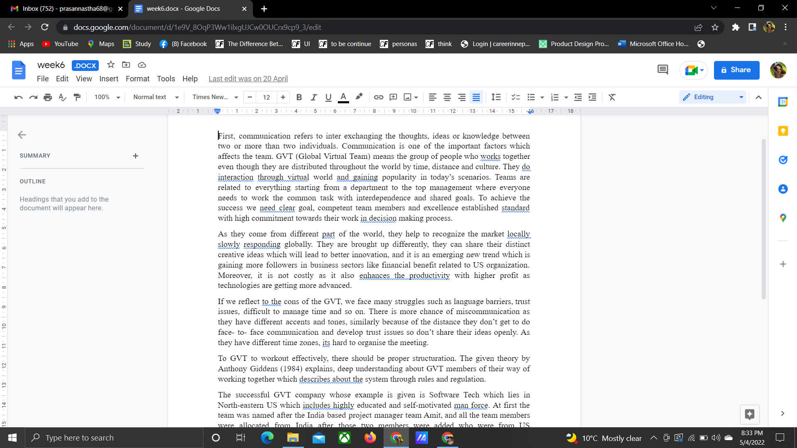

# prasanna
<html>
  <head>
  </head>
   <body>
    <h1>communication concepts and strategies </h1>
     
 Communication is the process of exchanging knowledge and information between two or more than two people via many modes such as emails, phone calls, face to face and etc.

     
     
 I contacted my unit co-ordinator via email when I had some confusion regarding my class

     
     
This is a screenshot of a video call that I did with my parents when I wanted to talk with them

     <h1><b>confidence and skills in oral communications and presentations</b> </h1>
      
     
I did the presentation of cyber security on week 7 of Professional Communications Skills for ICT subject

     <h1><b>Work effectively as part of a team </b></h1>
      
     
This shows that I have worked in a group on week6 assessment of Professional Communications Skills for ICT subject

      
     
This was a vacancy poster that I designed when I was doing internship in Infotech back in 2021 october.I had worked in designer as a part of a team. 
 
     <h1><b> Communicate effectively in a professional context</b></h1>
       
      
 The picture above shows that I have communicated with my lecturer and asked about how can I join from,when I had problem joining the lecture online via                   email.

      The picture above shows the last year scenario when I had taken part in UI/UX free class and when I was unable to join it, I discussed with the Kalsify group(who were providing free classes) about how and when to join the class.
     <h1> conflict management and resolution strategies </h1>
     
     
 This picture shows the group that I created in messenger when two of my friends had some kind of misunderstanding and they were not willing to talk to each other. I made them clear out their misunderstaing via group call and communicate properly.

  </body>
  </html>
  
