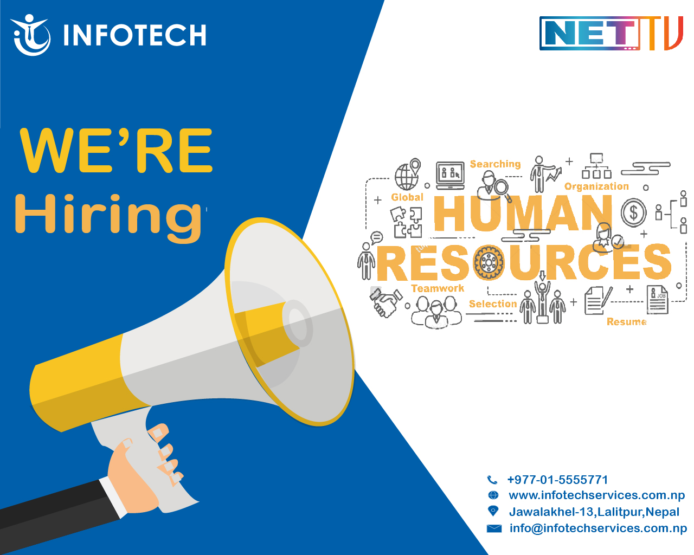

# prasanna
<html>
  <head>
    <title> heading </title>
  </head>
   <body>
    <h1>communication concepts and strategies </h1>
    <h2> confidence and skills in oral communications and presentations </h2>
      
     
I did the presentation of cyber security on week 7 of Professional Communications Skills for ICT subject

    <h3> Work effectively as part of a team </h3>
      
     
This shows that I have worked in a group on week6 assessment of Professional Communications Skills for ICT subject

      
     
This was a vacancy poster that I designed when I was doing internship in Infotech back in 2021 october.I had worked in designer as a part of a team. 
 
     <h4> Communicate effectively in a professional context </h4>
       
      
 The picture above shows that I have communicated with my lecturer and asked about how can I join from,when I had problem joining the lecture online via                   email.

      The picture above shows the last year scenario when I had taken part in UI/UX free class and when I was unable to join it, I discussed with the Kalsify group(who were providing free classes) about how and when to join the class.
    
    <h5> conflict management and resolution strategies </h5>
  </body>
  </html>
  
